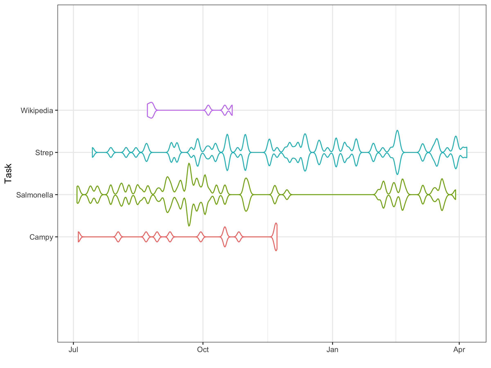

# TaskTracker

This is code designed to pull events from the Apple Calendar app and group them into projects you're working on. It allows you to visualise how your time is broken down across different projects and tasks within those projects. 

Projects are coded with a hash, e.g. #Project1

Subtasks are coded with a percentage sign, e.g. %Research

