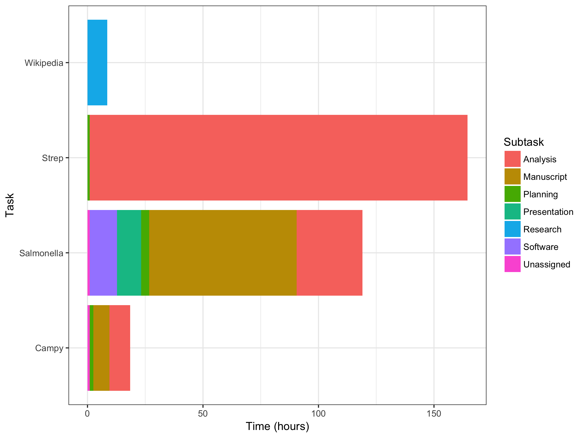

# TaskTracker

This is code designed to pull events from the Apple Calendar app and group them into projects you're working on. It allows you to visualise how your time is broken down across different projects and tasks within those projects. 

In order to use the tool, time spent on different projects needs to be stored as events in Apple calendar. Projects are coded with a hash, e.g. #Project1, subtasks are coded with a percentage sign, e.g. %Research.

Therefore a typical entry would look something like this: %Research for #Project1. The tool expects only one project and (optionally) one sub-tast per entry. 

